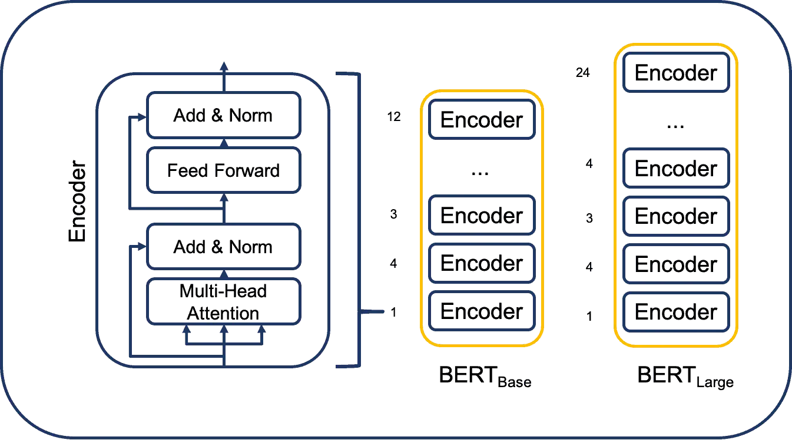
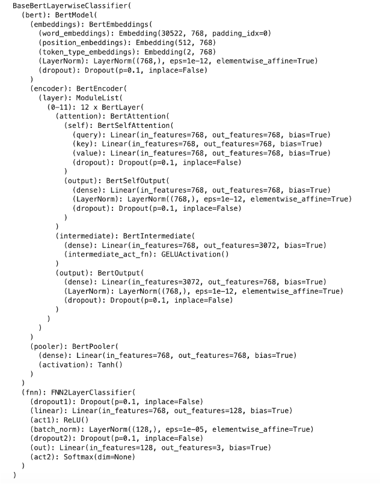

# Machine Learning Project: Grab that Attention!!

(Note: Workflow of the complete project can be found at CSE-633.ipynb file on the main branch)
(Find the presentation video here: https://drive.google.com/file/d/1Vk_VTuDbmc3NoVAZgPm4dRGmtJB7AVwN/view?usp=sharing)
(Final model can be found at https://drive.google.com/drive/folders/1VehW4V8-HjZjE6N5BqSJRFXkfcvB6KgM?usp=sharing)

## Introduction
This project focuses on using Transformer-based architectures, particularly BERT, for sentiment analysis. It explores text classification using state-of-the-art NLP models to categorize text into positive, neutral, and negative sentiments.

## Related Works
The project draws inspiration from several studies utilizing BERT and its variants for text classification. Notable papers include:
- Combining BERT with CNNs for enhanced text classification
- Ensembling RoBERTa models for improved performance 
- Methodology from "How to Fine-Tune BERT for Text Classification"

## BERT
The project utilizes BERT, a powerful pre-trained transformer model, for NLP tasks. BERT's architecture, using masked language modeling, enables comprehensive contextual understanding.



## Dataset Overview
The project uses the Yelp review dataset, consisting of around 174,000 reviews categorized with star ratings from 1 to 5. It faces challenges of imbalanced data distribution and variable review lengths, which are addressed using under-sampling techniques.

## Approach
The project approach involves:
- Designing the classifier using BERT
- Fine-tuning model parameters
- Layer-wise analysis of BERT for text classification
- Unfreezing BERT parameters for improved performance

## Experiments and Results
The project conducts experiments on the preprocessed dataset and evaluates various aspects:
- Classifier design: Two-layer classifier outperforms single-layer model
- Parameter tuning: MAX_LENGTH of 256 chosen for efficiency
- Layer-wise analysis: 12th layer of BERT shows superior classification ability
- Unfreezing BERT parameters boosts accuracy to 85.8%

## Final Model



## Conclusion
The study emphasizes the significance of classifier design, parameter tuning, and layer selection in optimizing BERT for text classification. It achieves an accuracy of 85.8% and an F1 score of 0.8731 by fine-tuning BERT parameters.

## Future work
Future work involves exploring alternative transformer models like DistilBERT, augmenting the dataset, and further tuning strategies for enhanced efficiency in text classification tasks.

---

This Markdown content summarizes the key aspects and outcomes of the machine learning project based on the LaTeX content provided.


## Installation

### Prerequisites
- Python 3.x
- PyTorch
- Transformers library
- Pandas
- tqdm
- argparse

### Installation Steps
1. Clone the repository:
   ```bash
   git clone https://github.com/sathvikkote/Text-Classification-Using-Base-Bert


### Usage

To train the model, execute the following commands:

```bash
python main.py --train <step>
```

Replace `<step>` with:

- `1` for Classifier Design
- `2` for Parameter Tuning
- `3` for Layer-wise Training
- `4` for Freeze and Unfreeze Training

### Evaluation

To evaluate a trained model, use:

```bash
python main.py --eval <path> <model_value> <name> <layer>
```

- `<path>`: Path to the trained model
- `<model_value>`: Model value (1 or 2)
- `<name>`: Name of the model
- `<layer>` (optional): Layer number
